# 跳跃表数据结构与算法分析

跳跃表[1,2]是一种用于在大多数应用程序中取代平衡树的概率数据结构。跳跃表拥有与平衡树相同的期望时间上界，并且更简单、更快、是用更少的空间。在查找与列表的线性操作上，比平衡树更快，并且更简单。

概率平衡也可以被用在基于树的数据结构[3]上，例如树堆（Treap）。与平衡二叉树相同，跳跃表也实现了以下两种操作

1. 通过搜索引用[4]，可以保证从任意元素开始，搜索到在列表中间隔为$k$的元素的任意期望时间是$O(log k)$
2. 实现线性表的常规操作（例如*将元素插入到列表第k个元素后面*）

这几种操作在平衡树中也可以实现，但是在跳跃表中实现起来更简单而且非常的快，并且通常情况下很难在平衡树中直接实现（树的线索化可以实现与链表相同的效果，但是这使得实现变得更加复杂[5]）

## 预览

最简单的支持查找的数据结构可能就是链表。Figure.1是一个简单的链表。在链表中执行一次查找的时间正比于必须考查的节点个数，这个个数最多是$N$。

<figure><figcaption align = "center">Figure.1 Linked List</figcaption></figure>

Figure.2表示一个链表，在该链表中，每个一个节点就有一个附加的指针指向它在表中的前两个位置上的节点。正因为这个前向指针，在最坏情况下最多考查$\lceil N/2\rceil+1$个节点。

<figure><figcaption align = "center">Figure.2 Linked List with fingers to the 2nd forward elements</figcaption></figure>

Figure.3将这种想法扩展，每个序数是4的倍数的节点都有一个指针指向下一个序数为4的倍数的节点。只有$\lceil N/4\rceil+2$个节点被考查。

<figure><figcaption align = "center">Figure.3 Linked List with fingers to the 4th forward elements</figcaption></figure>

这种跳跃幅度的一般情况如Figure.4所示。每个$2^i$节点就有一个指针指向下一个$2^i$节点，前向指针的间隔最大为$N/2$。可以证明总的指针最大不会超过$2N$，但现在在一次查找中最多考查$\lceil logN\rceil$个节点。这意味着一次查找中总的时间消耗为$O(logN)$，也就是说在这种数据结构中的查找基本等同于二分查找（binary search）。

<figure><figcaption align = "center">Figure.4 Linked List with fingers to the 2<sup>i</sup>th forward elements</figcaption></figure>

在这种数据结构中，每个元素都由一个节点表示。每个节点都有一个高度（height）或级别（level），表示节点所拥有的前向指针数量。每个节点的第$i$个前向指针指向下一个级别为$i$或更高的节点。

在前面描述的数据结构中，每个节点的级别都是与元素数量有关的，当插入或删除时需要对数据结构进行调整来满足这样的约束，这是很呆板且低效的。为此，可以*将每个$2^i$节点就有一个指针指向下一个$2^i$节点*的限制去掉，当新元素插入时为每个新节点分配一个随机的级别而不用考虑数据结构的元素数量。

虽然无法通过元素数量来确定每个节点的级别，但是通过考查Figure.1到Figure.4中的节点分布规律不难发现，*随着级别的增加，当前级别的节点数量成比例减少*。在Figure.1到Figure.4中，这个比例是$\frac{1}{2}$，也就是说只有$\frac{1}{2^i}$个节点的级别是$i$，随机选择节点的级别的概率分布遵循$P(X)=(\frac{1}{2})^X$。所以Figure.5也可以认为是这种数据结构的一个实例。

<figure><figcaption align = "center">Figure.5 Skip List</figcaption></figure>

## 数据结构

到此为止，已经得到了所有让链表支持快速查找的充要条件，而这种形式的数据结构就是跳跃表。接下来将会使用更正规的方式来定义跳跃表

1. 所有元素在跳跃表中都是由一个节点表示。
2. 每个节点都有一个高度或级别，有时候也可以称之为阶（step），节点的级别是一个与元素总数无关的随机数。规定`NULL`的级别是$\infty$。
3. 每个级别为$k$的节点都有$k$个前向指针，且第$i$个前向指针指向下一个级别为$i$或更高的节点。
4. 每个节点的级别都不会超过一个明确的常量`MaxLevel`。整个跳跃表的级别是所有节点的级别的最高值。如果跳跃表是空的，那么跳跃表的级别就是$1$。
5. 存在一个头节点`head`，它的级别是`MaxLevel`，所有高于跳跃表的级别的前向指针都指向`NULL`。

稍后将会提到，节点的查找过程是在头节点从最高级别的指针开始，沿着这个级别一直走，直到找到大于正在寻找的节点的下一个节点（或者是`NULL`），在此过程中除了头节点外并没有使用到每个节点的级别，因此**每个节点无需存储节点的级别**。

在跳跃表中，级别为$1$的前向指针与原始的链表结构中`next`指针的作用完全相同，因此跳跃表支持所有链表支持的算法。

对应到高级语言中的结构定义如下所示（后续所有代码示例都将使用C语言描述）

```c
#define SKIP_LIST_KEY_TYPE     int
#define SKIP_LIST_VALUE_TYPE   int
#define SKIP_LIST_MAX_LEVEL    32
#define SKIP_LIST_P            0.5

struct Node {
  SKIP_LIST_KEY_TYPE    key;
  SKIP_LIST_VALUE_TYPE  value;
  struct Node          *forwards[]; // flexible array member
};

struct SkipList {
  struct Node *head;
  int          level;
};

struct Node *CreateNode(int level) {
  struct Node *node;
  assert(level > 0);
  node = malloc(sizeof(struct Node) + sizeof(struct Node *) * level);
  return node;
}

struct SkipList *CreateSkipList() {
  struct SkipList *list;
  struct Node     *head;
  int              i;
  list = malloc(sizeof(struct SkipList));
  head = CreateNode(SKIP_LIST_MAX_LEVEL);
  for (i = 0; i < SKIP_LIST_MAX_LEVEL; i++) {
    head->forwards[i] = NULL;
  }
  list->head = head;
  list->level = 1;
  return list;
}
```

从前面的预览章节中，不难看出`MaxLevel`的选值影响着跳跃表的查询性能，关于`MaxLevel`的选值将会在后续章节中进行介绍。在此先将`MaxLevel`定义为$32$，这对于$2^{32}$个元素的跳跃表是足够的。延续预览章节中的描述，跳跃表的概率被定义为$0.5$，关于这个值的选取问题将会在后续章节中进行详细介绍。

## 算法

### 搜索

在跳跃表中进行搜索的过程，是通过Z字形遍历所有没有超过要寻找的目标元素的前向指针来完成的。在当前级别没有可以移动的前向指针时，将会移动到下一级别进行搜索。直到在级别为$1$的时候且没有可以移动的前向指针时停止搜索，此时直接指向的节点（级别为$1$的前向指针）就是包含目标元素的节点（如果目标元素在列表中的话）。在Figure.6中展示了在跳跃表中搜索元素$17$的过程。

<figure><figcaption align = "center">Figure.6 A search path to find element 17 in Skip List</figcaption></figure>

整个过程的示例代码如下所示，因为高级语言中的数组下标从`0`开始，因此`forwards[0]`表示节点的级别为$1$的前向指针，依此类推

```c
struct Node *SkipListSearch(struct SkipList *list, SKIP_LIST_KEY_TYPE target) {
  struct Node *current;
  int          i;
  current = list->head;
  for (i = list->level - 1; i >= 0; i--) {
    while (current->forwards[i] && current->forwards[i]->key < target) {
      current = current->forwards[i];
    }
  }
  current = current->forwards[0];
  if (current->key == target) {
    return current;
  } else {
    return NULL;
  }
}
```

### 插入和删除

在插入和删除节点的过程中，需要执行和搜索相同的逻辑。在搜索的基础上，需要维护一个名为`update`的向量，它维护的是搜索过程中跳跃表每个级别上遍历到的最右侧的值，表示插入或删除的节点的左侧直接直接指向它的节点，用于在插入或删除后调整节点所在所有级别的前向指针（与朴素的链表节点插入或删除的过程相同）。

当新插入节点的级别超过当前跳跃表的级别时，需要增加跳跃表的级别并将`update`向量中对应级别的节点修改为`head`节点。

Figure.7和Figure.8展示了在跳跃表中插入元素$16$的过程。首先，在Figure.7中执行与搜索相同的查询过程，在每个级别遍历到的最后一个元素在对应层级的前向指针被标记为灰色，表示稍后将会对齐进行调整。接下来在Figure.8中，在元素为$13$的节点后插入元素$16$，元素$16$对应的节点的级别是$5$，这比跳跃表当前级别要高，因此需要增加跳跃表的级别到$5$，并将`head`节点对应级别的前向指针标记为灰色。Figure.8中所有虚线部分都表示调整后的效果。

<figure><figcaption align = "center">Figure.7 Search path for inserting element 16</figcaption></figure>

<figure><figcaption align = "center">Figure.8 Insert element 16 and adjust forward pointers</figcaption></figure>

```c
struct Node *SkipListInsert(struct SkipList *list, SKIP_LIST_KEY_TYPE key, SKIP_LIST_VALUE_TYPE value) {
  struct Node *update[SKIP_LIST_MAX_LEVEL];
  struct Node *current;
  int          i;
  int          level;
  current = list->head;
  for (i = list->level - 1; i >= 0; i--) {
    while (current->forwards[i] && current->forwards[i]->key < target) {
      current = current->forwards[i];
    }
    update[i] = current;
  }
  current = current->forwards[0];
  if (current->key == target) {
    current->value = value;
    return current;
  }
  level = SkipListRandomLevel();
  if (level > list->level) {
    for (i = list->level; i < level; i++) {
      update[i] = list->header;
    }
  }
  current = CreateNode(level);
  current->key = key;
  current->value = value;
  for (i = 0; i < level; i++) {
    current->forwards[i] = update[i]->forwards[i];
    update[i]->forwards[i] = current;
  }
  return current;
}
```

在删除节点后，如果删除的节点是跳跃表中级别最大的节点，那么需要降低跳跃表的级别。

Figure.9和Figure.10展示了在跳跃表中删除元素$19$的过程。首先，在Figure.9中执行与搜索相同的查询过程，在每个级别遍历到的最后一个元素在对应层级的前向指针被标记为灰色，表示稍后将会对齐进行调整。接下来在Figure.10中，首先通过调整前向指针将元素$19$对应的节点从跳跃表中卸载，因为元素$19$对应的节点是级别最高的节点，因此将其从跳跃表中移除后需要调整跳跃表的级别。Figure.10中所有虚线部分都表示调整后的效果。

<figure><figcaption align = "center">Figure.9 Search path for deleting element 19</figcaption></figure>

<figure><figcaption align = "center">Figure.10 Delete element 19 and adjust forward pointers</figcaption></figure>

```c
struct Node *SkipListDelete(struct SkipList *list, SKIP_LIST_KEY_TYPE key) {
  struct Node *update[SKIP_LIST_MAX_LEVEL];
  struct Node *current;
  int          i;
  current = list->head;
  for (i = list->level - 1; i >= 0; i--) {
    while (current->forwards[i] && current->forwards[i]->key < key) {
      current = current->forwards[i];
    }
    update[i] = current;
  }
  current = current->forwards[0];
  if (current && current->key == key) {
    for (i = 0; i < list->level; i++) {
      if (update[i]->forwards[i] == current) {
        update[i]->forwards[i] = current->forwards[i];
      } else {
        break;
      }
    }
    while (list->level > 1 && list->head->forwards[list->level - 1] == NULL) {
      list->level--;
    }
  }
  return current;
}
```

### 生成随机级别

在前面提到过，*随机选择节点的级别的概率分布遵循概率为$\frac{1}{2}$的指数分布*，也就是说第$i+1$层的节点数量是第$i$层的一半。为了避免使用魔法值，定义一个分数$p$代表节点同时带有第$i$层前向指针和第$i+1$层前向指针的概率（在之前的讨论中，$p=\frac{1}{2}$）。节点的级别可以使用如下方法随机生成，在这个算法中节点的级别可以在不依赖跳跃表元素数量的前提下生成

```c
int SkipListRandomLevel() {
  int level;
  level = 1;
  while (random() < RAND_MAX * SKIP_LIST_P && level <= SKIP_LIST_MAX_LEVEL) {
    level++;
  }
  return level;
}
```

以下表格为按上面算法执行$2^{32}$次后，所生成的随机级别的分布情况。

| **1**      | **2**      | **3**     | **4**     | **5**     | **6**    | **7**    | **8**    |
| ---------- | ---------- | --------- | --------- | --------- | -------- | -------- | -------- |
| 2147540777 | 1073690199 | 536842769 | 268443025 | 134218607 | 67116853 | 33563644 | 16774262 |
| **9**      | **10**     | **11**    | **12**    | **13**    | **14**   | **15**   | **16**   |
| 8387857    | 4193114    | 2098160   | 1049903   | 523316    | 262056   | 131455   | 65943    |
| **17**     | **18**     | **19**    | **20**    | **21**    | **22**   | **23**   | **24**   |
| 32611      | 16396      | 8227      | 4053      | 2046      | 1036     | 492      | 249      |
| **25**     | **26**     | **27**    | **28**    | **29**    | **30**   | **31**   | **32**   |
| 121        | 55         | 34        | 16        | 7         | 9        | 2        | 1        |

### MaxLevel的选择

在Figure.4中曾给出过对于10个元素的跳跃表最理想的分布情况，其中5个节点的级别是1，3个节点的级别是2，1个节点的级别是3，1个节点的级别是4。

这引申出一个问题：*既然相同元素数量下，跳跃表的级别不同会有不同的性能，那么跳跃表的级别为多少才合适？*

经过分析得出，跳跃表在级别$L$上期望的节点数量是$\frac{1}{p}$，当$L=log_{\frac{1}{p}}n$时这是成立的[1]。在此可以定义$L(n)$来代表$log_{\frac{1}{p}}n$。

由于级别可以安全地限定在$L(n)$，可以选择$MaxLevel=L(N)$（$N$是跳跃表中元素数量的上限）。如果$p=\frac{1}{2}$，那么$MaxLevel=32$就可以安全地包含最多$2^{32}$个元素。

## 分析

### 不严谨的分析

前面提到过，*分数$p$代表节点同时带有第$i$层前向指针和第$i+1$层前向指针的概率*，也就是说相邻两个级别为$i+k (k>0)$的节点中间期望有$\frac{1}{p}-1$个级别为$i$的节点。

而通过考查Figure.6搜索路径，不难发现，在级别$i$的搜索永远不会触达级别大于$i$的节点（因为级别大于$i$的节点已经在级别$i+k(k>0)$的搜索中被否决），因此可以认为在理想情况下每一层最多只需要访问$\frac{1}{p}$个节点。

由搜索是通过Z字形遍历所有没有超过要寻找的目标元素的前向指针来完成的，因此搜索总是需要经过$L(n)$层。所以期望的访问次数是$\frac{1}{p}L(n)$，因为$L(n)=log_\frac{1}{p}n$，所以期望的访问次数是$\frac{1}{p}log_\frac{1}{p}n$，因为$1/p$是可以确定的常数，因此跳跃表的搜索、插入和删除的时间复杂度都是$O(log n)$

### 严谨的分析

TODO

## 扩展

### 快速随机访问

在跳跃表中通过前向引用实现了$O(log_\frac{1}{p}n)$时间复杂度的搜索、插入与删除算法，但是对于随机访问数组中第$i$个元素操作仍需要$O(i)$时间。通过观察Figure.7中的Z字形搜索路径，不难发现，从头节点到某个节点的路径中所有前向指针的跨度的和，就是这个节点在跳跃表中的位置。那么通过在前向指针中维护当前节点到目标节点的跨度，就可以保证随机访问的时间复杂度也是$O(log_\frac{1}{p}n)$。

首先，需要对数据结构重新进行定义，在前向指针中增加跨度相关的记录，并将其初始设置为0。此外，可以认为`NULL`在跳跃表中的位置永远是跳跃表的长度（从`0`开始），因此需要在跳跃表中记录总长度。
```c
#define SKIP_LIST_KEY_TYPE     int
#define SKIP_LIST_VALUE_TYPE   int
#define SKIP_LIST_MAX_LEVEL    32
#define SKIP_LIST_P            0.5

struct Node; // forward definition

struct Forward {
  struct Node *forward;
  int          span;
}

struct Node {
  SKIP_LIST_KEY_TYPE    key;
  SKIP_LIST_VALUE_TYPE  value;
  struct Forward        forwards[]; // flexible array member
};

struct SkipList {
  struct Node *head;
  int          level;
  int          length;
};

struct Node *CreateNode(int level) {
  struct Node *node;
  assert(level > 0);
  node = malloc(sizeof(struct Node) + sizeof(struct Forward) * level);
  return node;
}

struct SkipList *CreateSkipList() {
  struct SkipList *list;
  struct Node     *head;
  int              i;
  list = malloc(sizeof(struct SkipList));
  head = CreateNode(SKIP_LIST_MAX_LEVEL);
  for (i = 0; i < SKIP_LIST_MAX_LEVEL; i++) {
    head->forwards[i].forward = NULL;
    head->forwards[i].span = 0;
  }
  list->head = head;
  list->level = 1;
  return list;
}
```

接下来需要修改插入和删除操作，来保证在跳跃表修改后跨度的数据完整性。

需要注意的是，在插入过程中需要使用`indices`记录在每个层级遍历到的最后一个元素的位置，这样通过做简单的减法操作就可以知道每个层级遍历到的最后一个元素到新插入节点的跨度。

以下代码参考自Redis的跳跃表实现[6], 为了与前面的代码风格保持一致，进行了适当的修改
```c
struct Node *SkipListInsert(struct SkipList *list, SKIP_LIST_KEY_TYPE key, SKIP_LIST_VALUE_TYPE value) {
  struct Node *update[SKIP_LIST_MAX_LEVEL];
  struct Node *current;
  int          indices[SKIP_LIST_MAX_LEVEL];
  int          i;
  int          level;
  current = list->head;
  for (i = list->level - 1; i >= 0; i--) {
    if (i == list->level - 1) {
      indices[i] = 0;
    } else {
      indices[i] = indices[i + 1];
    }
    while (current->forwards[i].forward && current->forwards[i].forward->key < target) {
      indices[i] += current->forwards[i].span;
      current = current->forwards[i].forward;
    }
    update[i] = current;
  }
  current = current->forwards[0].forward;
  if (current->key == target) {
    current->value = value;
    return current;
  }
  level = SkipListRandomLevel();
  if (level > list->level) {
    for (i = list->level; i < level; i++) {
      indices[i] = 0;
      update[i] = list->header;
      update[i]->forwards[i].span = list->length;
    }
  }
  current = CreateNode(level);
  current->key = key;
  current->value = value;
  for (i = 0; i < level; i++) {
    current->forwards[i].forward = update[i]->forwards[i].forward;
    update[i]->forwards[i].forward = current;
    current->forwards[i].span = update[i]->forwards[i].span - (indices[0] - indices[i]);
    update[i]->forwards[i].span = (indices[0] - indices[i]) + 1;
  }
  list.length++;
  return current;
}
```

```c
struct Node *SkipListDelete(struct SkipList *list, SKIP_LIST_KEY_TYPE key) {
  struct Node *update[SKIP_LIST_MAX_LEVEL];
  struct Node *current;
  int          i;
  current = list->head;
  for (i = list->level - 1; i >= 0; i--) {
    while (current->forwards[i].forward && current->forwards[i].forward->key < key) {
      current = current->forwards[i].forward;
    }
    update[i] = current;
  }
  current = current->forwards[0].forward;
  if (current && current->key == key) {
    for (i = 0; i < list->level; i++) {
      if (update[i]->forwards[i].forward == current) {
        update[i]->forwards[i].forward = current->forwards[i];
        update[i]->forwards[i].span += current->forwards[i].span - 1;
      } else {
        break;
      }
    }
    while (list->level > 1 && list->head->forwards[list->level - 1] == NULL) {
      list->level--;
    }
  }
  return current;
}
```

当实现了快速随机访问之后，通过简单的指针操作即可实现区间查询功能。

## 参考文献

1.  Pugh, William. (1990). A Skip List Cookbook. 
2. Weiss, M. A. (1996). *Data Structures and Algorithm Analysis in C (2nd Edition)* (2nd ed.). Pearson.
3. Aragon, Cecilia & Seidel, Raimund. (1989). Randomized Search Trees. 540-545. 10.1109/SFCS.1989.63531. 
4. Wikipedia contributors. (2022b, November 22). *Finger search*. Wikipedia. https://en.wikipedia.org/wiki/Finger_search
5. Wikipedia contributors. (2022a, October 24). *Threaded binary tree*. Wikipedia. https://en.wikipedia.org/wiki/Threaded_binary_tree
6. Redis contributors. *Redis ordered set implementation*. GitHub. https://github.com/redis/redis 